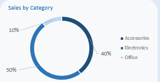
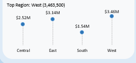
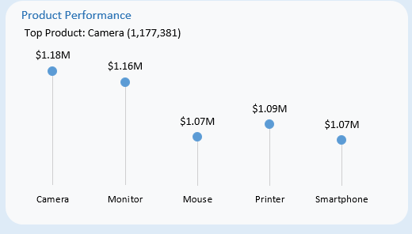
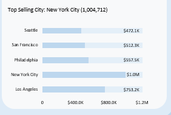
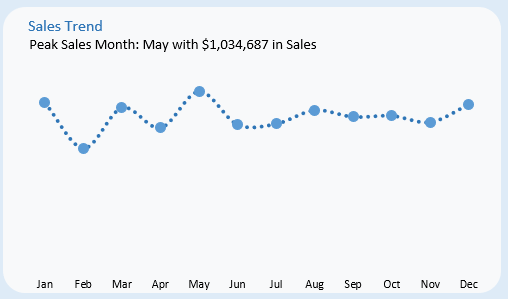
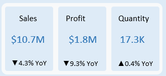

# E-Commerce-Sales-Performance-Analysis

## Background and Overview
This project analyzes transactional e-commerce sales data to understand key drivers of business performance. The goal of the analysis is to examine how sales, profit, and product demand vary across product categories, geographic regions, and time.

Using Microsoft Excel, the dataset was transformed and explored to identify patterns in revenue generation, regional demand distribution, and product performance. Interactive dashboard components were created to allow dynamic exploration of key metrics such as top performing products, leading regions, and highest-selling cities.

The resulting dashboard provides a high-level view of business performance while enabling deeper investigation into operational and sales trends.

---

## Data Structure Overview
The dataset contains **3,500 transactional records** representing e-commerce sales activity.

Each row corresponds to a product purchase within a specific location and time period.

### Key Fields

**Order Date**  
Date when the purchase occurred.

**Product Name**  
The product sold during the transaction.

**Category**  
Product classification. The dataset includes three main categories:
- Electronics  
- Accessories  
- Office  

**Quantity**  
Number of units purchased.

**Sales**  
Total revenue generated from the transaction.

**Profit**  
Net profit generated from the transaction.

**Country, City, State**  
Geographic location where the purchase occurred.

**Region**  
Regional grouping of states used for performance comparisons.

These fields enable analysis across three major dimensions:

- Product performance  
- Geographic sales distribution  
- Time-based sales trends  

---

## Technical Stack
The entire project was completed using **Microsoft Excel**.

Excel was used both for **data transformation** and **visual analytics**.

### Key Tools Used

**Power Query**  
Used to import and prepare the dataset for analysis.

**Excel Formulas**  
Used to build dynamic text elements that update automatically when dashboard slicers are applied. These formulas allow the dashboard to display real-time insights such as the current top performing region or product.

**Pivot Tables**  
Used to aggregate and summarize sales metrics across product categories, regions, and time periods.

**Excel Charts**  
Multiple chart types were used to present the insights visually, including:
- Pie charts
- Lollipop charts
- Line charts
- Bar charts
- Geographic maps

**Interactive Slicers**  
Slicers were implemented to allow users to dynamically filter the dashboard and update all visualizations simultaneously.

---

## Executive Summary
The analysis reveals that **electronics products dominate overall revenue**, while **accessories contribute a strong secondary share of sales**. Office-related products represent a smaller but stable segment of the business.

Geographically, **the West region generates the highest total sales**, slightly outperforming the East and South regions. Sales distribution across regions is relatively balanced, suggesting a broadly distributed customer base.

At the city level, **New York City emerges as the highest-revenue market**, followed by Los Angeles and Philadelphia. These urban centers appear to serve as major demand hubs for the business.

Product-level analysis shows strong performance from **camera, monitor, and printer products**, indicating that high-value electronics drive a significant portion of revenue.

Sales remain relatively consistent throughout the year, although **May represents the strongest month for revenue**, suggesting potential seasonal demand fluctuations.

Overall, the data suggests that business performance is strongly influenced by **electronics product demand and major metropolitan markets**.

---

# Insights Deep Dive

## Category Performance
Electronics generates the largest share of total sales, contributing **$5.33M in revenue**, which represents **49.9% of total company sales**.

Accessories follow closely with **$4.25M in revenue**, accounting for **39.8% of total sales**, while Office products contribute **$1.09M**, representing **10.3% of revenue**.

This distribution indicates that nearly **90% of total revenue comes from electronics and accessory products**, highlighting the company’s strong dependence on technology-related goods.

High-value electronics items such as **cameras and monitors** play a significant role in driving this category dominance.

---

## Regional Sales Performance
The **West region generates the highest revenue**, producing **$3.46M in sales**, equivalent to **32.5% of total company revenue**.

The **East region follows closely with $3.14M (29.4%)**, while the **Central region contributes $2.52M (23.7%)**.

The **South region records the lowest sales at $1.54M (14.4%)**.

Although the West leads overall performance, the relatively balanced distribution across regions suggests that the company maintains **a broad national customer base rather than relying on a single geographic market**.

---

## Product Performance
Product-level analysis reveals a group of high-performing products responsible for a substantial share of revenue.

### Top Performing Products

- **Camera — $1.18M in sales**
- **Monitor — $1.16M**
- **Printer — $1.09M**
- **Mouse — $1.07M**
- **Smartphone — $1.07M**

These products represent a mix of **premium electronics and frequently purchased peripherals**, suggesting that both high-ticket items and everyday accessories contribute meaningfully to revenue generation.

Notably, the **top five products alone generate over $5.5M in revenue**, representing **more than 50% of total sales**.

---

## City-Level Sales Distribution
Major metropolitan areas account for a significant share of total sales.

### Top Performing Cities

- **New York City — $1.00M in sales**
- **Los Angeles — $753K**
- **Philadelphia — $558K**
- **San Francisco — $512K**
- **Seattle — $472K**

New York City alone generates **nearly 10% of total company revenue**, highlighting its importance as a key market.

The strong presence of large urban centers suggests that **population density and purchasing power strongly influence demand patterns**.

---

## Monthly Sales Trend
Sales remain relatively stable throughout the year, though moderate fluctuations appear across months.

The strongest month is **May**, generating **$1.03M in revenue**, making it the peak sales period in the dataset.

The lowest performing month is **February**, with **$702K in sales**.

Despite these fluctuations, the absence of extreme seasonal spikes suggests that the business experiences **relatively steady demand across the year**, with occasional peaks likely influenced by promotional activity or product demand cycles.

---

## Overall Performance Snapshot
Across the **3,500 recorded transactions**, the business generated:

- **$10.7M in total sales**
- **$1.8M in total profit**
- **17,261 total units sold**

This indicates an overall **profit margin of roughly 17%**, suggesting healthy profitability across the product mix.

---

# Recommendations
Based on the analysis, several strategic opportunities emerge.

- Expand marketing efforts around **high-performing electronics products**, particularly cameras and monitors, as these products generate significant revenue.
- Focus targeted promotions and advertising in **top-performing metropolitan markets** such as New York City and Los Angeles to maximize returns in high-demand areas.
- Leverage the strong performance of **accessories products** to create product bundles with electronics devices, potentially increasing **average order value**.
- Investigate the drivers behind **May’s strong performance** to determine whether seasonal promotions or product launches could be strategically replicated in other months.
- Continue strengthening **nationwide market presence**, as the balanced regional sales distribution suggests that demand exists across multiple geographic areas.
